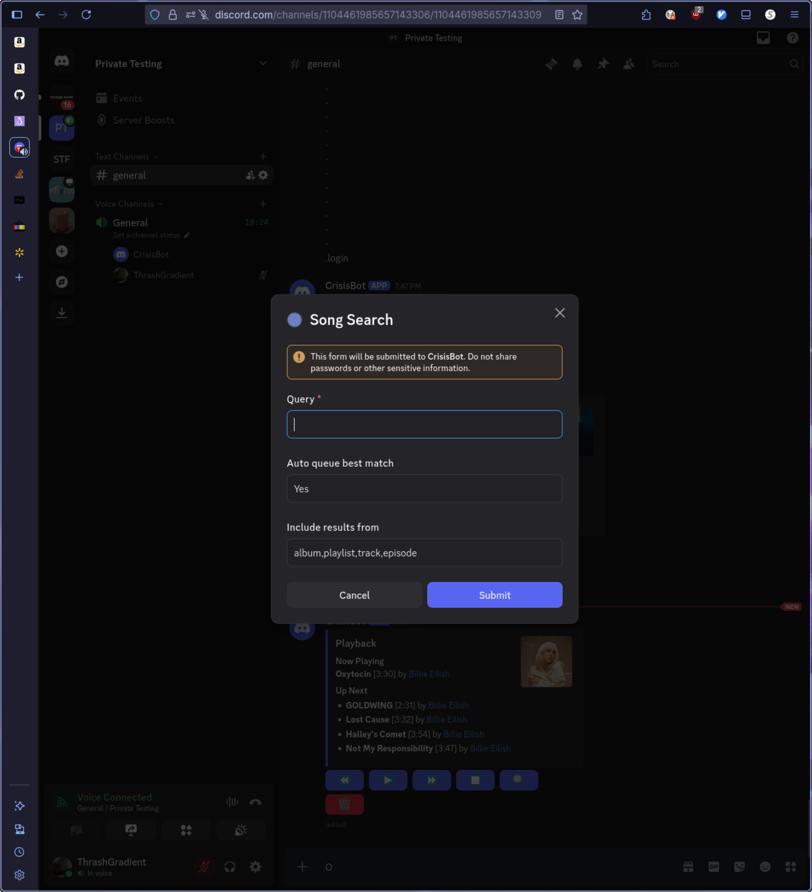

# Bot Updates 

## TLDR 
- `.playback` command is how you should interact with the bot 
- Click the search button in the Playback UI to add songs/podcast episodes to the queue. I highly recommend reading [Search Form](#search-form) to get more details on this as it can be fairly handy.

## The Playback Command 
The main way to interact with the bot now is the `.playback` command. The command takes no arguments, simply login to the bot like normal with `.login`, then run `.playback`. Give it a minute, and your screen should look something like this: 

### Information Section 
The first part of the Playback GUI is the "Now Playing" section that shows the title, duration, artist, and album art of the currently playing track or podcast episode. 

Next up is the "Next Up" section. Here you will find the 4 next items in the DJ's queue. Like in "Now Playing", each line shows the title, duration, and artist of the track. 

### Controls Section
Several buttons to control or interact with Spotify live at the bottom of the Playback GUI. From left to right they are: 
- Skip Back 
    - Returns to the beginning of the currently playing track 
    - Returns to the previous track if you are within the first few seconds of the current track 
    - If you want to return to the previous track while currently in the middle of the current track, hit this button twice in a row 
- Play/Pause
    - Either resumes or pauses playback depending on the current state 
- Skip Next 
    - Skips to the next track in the queue 
- Stop 
    - Stops Spotify playback and causes the bot to leave any voice channels it's in 
- Search 
    - Opens a form to search for a song/playlist/album/podcast episode to add to the queue 
    - See [Search Form](#search-form) for more details 
- Clear Queue 
    - Empties the Spotify queue making the last track in the queue the "Now Playing" item 

### Search Form 
Clicking the "Search" button will open a form you can fill out to fine tune your search. 

- Query 
    - What you're searching for. Could be anything, but I recommend searching for a track name and artist
    - EG "bb mixes vol 15" to find Big Booty Mix Volume 15
- Auto Queue 
    - If "Yes", the bot will automatically add the search result that is closest to your query to the queue 
    - If anything other than yes - IE "No" or blank - You will be presented with a variety of search results from each category that you searched for that you may choose from 
- Include Results 
    - A comma separated list of Spotify objects to include search results for. Valid options are any combination of "album", "playlist", "track", "episode"
        - "track" refers to a song, like "W.A.P." by Ben Shapiro 
        - "episode" refers to a single episode of a podcast, like "Woke Movie promotes VIOLENCE against ICE" by the Ben Shapiro Show 
        - "album" and "playlist" refer to what you think they do
    - You may remove options from the list to remove results from catagories you don't care about
    - Rearranging the options has no effect on the search 
    - Leaving this field blank will only return search results from "tracks". IE songs 
    - Queuing playlists or albums will queue up to the first 20 items in the playlist or album 
